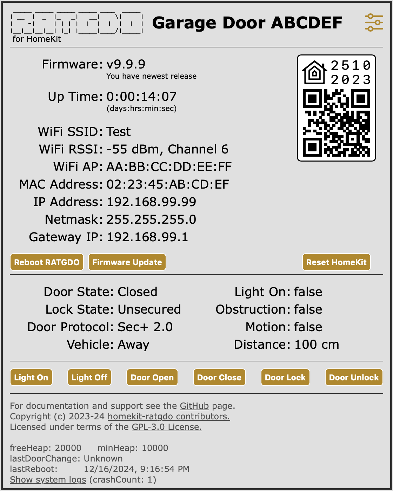
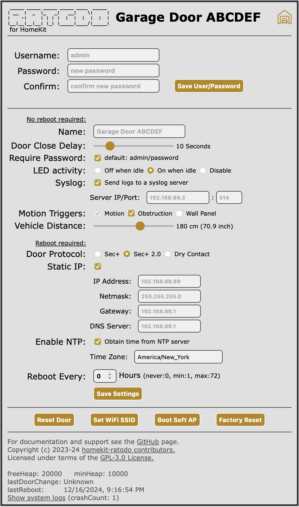

> [!IMPORTANT]
> This firmware is for the ratgdo32 and ratgdo32-disco series boards. It will not work with the ratgdo v2.5xi boards.
> HomeKit support for for the original v2.5xi devices can be found [here](https://github.com/ratgdo/homekit-ratgdo)
>
> **THIS IS EARLY FIRMWARE still under test.
> Future updates MAY include breaking changes requiring a flash erase and re-upload.**
>
> Firmware for the new DISCO device is under development. The following features, documented in this README, are not currently available in this version
> and may never be implemented
> 
> * Crashlog display and download.
> * Locking WiFi to specific WiFi access point.
> * Setting WiFi protocol version.
> * Setting WiFi transmit power.

# What is HomeKit-RATGDO?

HomeKit-ratgdo32 is alternative firmware for the ratgdo32-series WiFi control boards that works
over your _local network_ using HomeKit, or over the internet using your Apple HomeKit home hubs, to
control your garage door opener. It requires no supporting infrastructure such as Home Assistant,
Homebridge, MQTT, etc, and connects to your garage door opener with as few as three wires.

This firmware supports Security+, Security+ 2.0 and Dry Contact enabled garage door openers

## What does this firmware support?

* Opening and closing multiple garage doors independently in the same HomeKit home.
* Light Control and Status
* Obstruction sensor reporting
* Motion sensor reporting, if you have a "smart" wall-mounted control panel or with the obstruction sensor
* Vehicle presence, arrival and departure sensing (ratgdo32-disco board only)
* Parking assist laser (ratgdo32-disco board only)

Check the [GitHub Issues](https://github.com/ratgdo/homekit-ratgdo32/issues) for planned features, or to suggest your own.

## How do I install it?

Connect your ratgdo to a computer with a USB cable and use the [online browser-based flash tool](https://ratgdo.github.io/homekit-ratgdo32/flash.html) to install the firmware.

> [!NOTE]
> The browser must be able to access a USB serial device. Some browsers block USB access. The Google Chrome browser is known to work and is recommended.

After flashing the firmware, the browser-based tool will give you the option to provision WiFi network and password, and following that the option to connect to the ratgdo from where you can configure settings.

If you skip this step, then you can set the network and password later using a laptop, phone or tablet.
Search for the WiFi network named _Garage Door ABCDEF_ where the last six characters are a unique identifier. Once connected use a browser to access http://192.168.4.1 and wait for it to display a list of WiFi networks to join.

After selecting the WiFi network the device will reboot and you can connect to it using a browser on your network at the address http://Garage-Door-ABCDEF.
Once the device is running you can change the name and add it to HomeKit by scanning the QR code.

The manual setup code is `2510-2023`.

> [!WARNING]
> Only add one ratgdo device at a time.  If you have multiple ratgdo devices, make sure that any not already paired to
HomeKit are turned off... except the one that you want to add.

> [!NOTE]
> If you experience very slow or poor connection accessing the ratgdo device web page then try moving the device further away from the garage door opener.  Several users have reported that this can improve reliability of the connection. We do not know why this is the case but may suggest some RF interference between the door opener and the ratgdo device.

## HomeKit support

When you first add the device to HomeKit a number of accessories are added:

* HomeKit _bridge_ to which all other accessories are attached
* _garage door_ with door state, obstruction detection and lock. Lock not available with Dry Contact protocol
* _light switch_. Not available with Dry Contact protocol
* _motion_ sensor. Automatically added for doors with wall panels that detect motion. Also can be optionally added and triggered by a button press on the wall panel and/or triggering the obstruction sensor.
* Vehicle arriving _motion_ sensor. Only on ratgdo32-disco boards, triggers motion if it detects arrival of a vehicle.
* Vehicle departing _motion_ sensor. Only on ratgdo32-disco boards, triggers motion if it detects departure of a vehicle.
* Vehicle presence _occupancy_ sensor. Only on ratgdo32-disco boards, set if the distance sensor detects presence of a vehicle.
* Parking assist laser _light switch_. Only on ratgdo32-disco boards.

Vehicle arrival and departing sensors are only triggered if vehicle motion is detected within 5 minutes of door opening or closing. The parking assist
laser is activated for one minute when vehicle arrival is detected.

See below for instructions on setting the distance threshold for triggering vehicle presence.

If you select _Identify_ during the add accessory process then the blue LED and Laser will light and the beeper sound for 2 seconds.

## Using ratgdo Webpage

Before pairing to HomeKit / Apple Home you should open up the ratgdo webpage and configure basic settings.  Simply enter the local name or IP address of the ratgdo device to access the settings page to set a more appropriate device name and check that your door protocol is correct.

[](#webpage)

The webpage comprises three sections, HomeKit and ratgdo device status, garage door opener status, and an information and diagnostic section.

### HomeKit and ratgdo status

If you ratgdo device is not yet paired to HomeKit then a QR code is displayed for you to scan and add the garage door to HomeKit. If the device is already paired then this is replaced with a statement that you must first un-pair the device if you wish to use it with another HomeKit home.  A Reset or Un-pair HomeKit button is provided for this.

> [!NOTE]
> If you will re-pair to the same HomeKit home you must also delete the accessory from HomeKit as well as un-pairing at the ratgdo device.

This section also displays the current firmware version, with a statement on whether an update is available, the uptime of the device in days/hours/minutes/seconds and WiFi connection status.

> [!NOTE]
> If the word _locked_ appears after the WiFi AP identifier then the ratgdo device will _only_ connect to that WiFi Access Point. See warning in the [Set WiFi SSID](#set-wifi-ssid) section below.

### Garage door opener status

Status of the garage door along with action buttons are shown in this section.  The status values are updated in real time whether triggered by one of the action buttons or an external action (motion in the garage, someone using a door remote).

For ratgdo32-disco boards, vehicle status is shown as Away, Parked, Arriving or Departing. A distance value in centimeters is also shown that represents the distance between the ratgdo board and either the garage floor (if no vehicle present) or the roof/hood of the vehicle.  It is normal for this value to fluctuate. See section below on setting vehicle distance threshold.

### Information section

The final section provides useful links to documentation and legal/license information.  At the very bottom of the page is diagnostic information, see [Troubleshooting](#troubleshooting) section below.

### Authentication

By default authentication is not required for any action on this web page.  However it is strongly recommended that you enable the setting to require a password and change the default. If authentication is enabled then all buttons _except_ Reboot are protected with a username and password

#### Default Username/Password: `admin`/`password`

> [!NOTE]
> The device uses _Digest Authentication_ supported in all web browsers, this is not cryptographically secure but is sufficient to protect against unauthorized or inadvertent access. Note that web browsers remember the username and password for a period of time so you will not be prompted to authenticate for every access.

You can change the user name and password by clicking into the settings page:

[](#settings)

## Settings Webpage

[](#password)

The settings page allows you to input a new user name and password. Saving a new password will return you to the main webpage from which point you will have to authenticate with the new password to access the settings page or any of the action buttons (except for reboot).

When you save settings from this page the ratgdo device will either return immediately to the main page or, if required, reboot return to the main page and after a 30-second countdown.

### Name

This updates the name reported to HomeKit and for mDNS device discovery.  The default name is _Garage Door ABCDEF_ where the last 6 characters are set to the MAC address of the ratgdo device. Changing the name after pairing with HomeKit does not change the name within HomeKit or Apple Home.  The maximum length is 31 characters.  For network hostname the length is truncated to 23 characters and all spaces are replaced with a hyphen.

### Door Close Delay

You can select up-to 60 second delay before door starts closing. During the delay period the garage door lights will flash and you may hear the relay clicking. On ratgdo32-disco boards you will also hear an audible beep.

### Require Password

If selected then all the action buttons _except reboot_, and access to the settings page, will require authentication.  Default is not required.

### LED activity

If selected _On when idle_, then the blue LED light on the ratgdo device will remain illuminated when the device is idle and flash off when there is activity.  If you prefer the LED to remain off while idle then select _Off when idle_ and the LED to flash on with activity.  You can also _Disable_ the blue LED.  Note that the ratgdo32-disco boards also have a red power LED light. This cannot be controlled and is always on when power is connected.

### Syslog

This setting allows you to send the ratgdo logs to a syslog server.  Enter the IP address of your syslog server.  Uses UDP port 514 by default and logs to the LOCAL0 Facility.

> [!NOTE]
> If your ratgdo is on an IoT VLAN or otherwise isolated VLAN, then you need to make sure it has access to your syslog server.  If the syslog server is on a separate VLAN, you need to allow UDP port 514 through the firewall.

### Motion Triggers

This allows you to select what causes the HomeKit motion sensor accessory to trigger.  The default is to use the motion sensor built into the garage door opener, if it exists.  This checkbox is not selectable because presence of the motion sensor is detected automatically... based on detecting motion in the garage.  If your door opener does not have a motion sensor then the checkbox will show as un-checked.

Motion can also be triggered by the obstruction sensor and by pressing the door, light or lock buttons on the door opener wall panel.  These are disabled by default but may be selected on the web page.

### Vehicle Distance

Ratgdo32-disco boards detect vehicle arrival, departure and presence based on distance measured from the ratgdo board.  You should monitor the value
reported in vehicle distance when there is no vehicle present (the approximate distance to the floor) and when the vehicle is parked (the approximate
distance to the vehicle roof or hood).  Set the vehicle distance slider to between these these two values.  Measured distance can fluctuate so allow
for this when setting the value.

### Door Protocol

Set the protocol for your model of garage door opener.  This defaults to Security+ 2.0 and you should only change this if necessary.  Note that the changing the door protocol also resets the door opener rolling codes and whether there is a motion sensor (this will be automatically detected after reset).

### WiFi Version _(not supported on ratgdo32 boards)_

If the device fails to connect reliably and consistently to your WiFi network it may help to lock it to a specific WiFi version. The ratgdo supports 802.11b, 802.11g and 802.11n on the 2.4GHz WiFi band and by default will auto-select. If it helps in your network, select the specific version you wish to use.

### WiFi Tx Power _(not supported on ratgdo32 boards)_

You can set the WiFi transmit power to between 0 and 20 dBm. It defaults to the maximum (20.5 dBm, displayed as 20 dBm) but you may wish to fine tune this to control how the device connects to available WiFi access points.

> [!NOTE]
> If the ratgdo device fails to connect to a WiFi access point by approximately 40 seconds after a reboot from a setting change, then the device will reset all the WiFi settings and will then attempt to reconnect to the server.

### Static IP

If selected then you can enter a static IP address, network mask, gateway IP and DNS server IP.  Note that if the address changes, then after reboot the web page will not automatically reload from the new IP address... you will need to manually connect to the ratgdo device at its new address. __Most users should NOT select static IP__ as it is far safer to use DHCP to automatically configure the device.

Ratgdo tests for network connection approximately 30 seconds after a reboot from a WiFi setting change. If this fails then the device will disable static IP and will attempt to reconnect to the network using DHCP.

> [!NOTE]
> You must provide an IP address for DNS (Domain Name Service), this is required to set the clock on ratgdo with Network Time Protocol (NTP). Most household gateway routers act as DNS servers so you can use the same IP address as the gateway.

> [!WARNING]
> If you enter an IP address that is not valid on your network then you will not be able to access the device by web browser or from HomeKit. If the device fails to automatically recover by resetting to DHCP, then you can recover by using the soft AP mode described below in [Set WiFi SSID](#set-wifi-ssid) (press light button 5 times). If this also fails then you will need to flash the ratgdo over the USB port using the web installer AND select the option to erase the device.  This will factory reset the device and you will have to remove the garage door accessory from HomeKit and then add it again.

### Enable NTP

The ratgdo device will obtain current time from an NTP (Network Time Protocol) server. This requires internet access and the default setting is disabled.

When enabled, the _lastDoorChange_ date and time (reported at the bottom of the web page) is saved across reboots and the actual time of log data is reported when viewed in the browser system logs page.

### Time Zone

You can select time zone for your location.  On fist boot, or after changing the WiFi network SSID, the ratgdo will reset to GMT/UTC and then attempt to obtain your time zone by geo-locating the external IP address of the network that ratgdo is connected to.  The discovered time zone will take effect immediately after you view the ratgdo web page.

### Reboot Every

During early development there were several reports that the ratgdo device would reset itself and loose its pairing with HomeKit. To reduce the chance of this occurring a regular (e.g. daily) reboot of the device provided a work-around. The firmware is far more stable now and it is hoped that this is no longer required. This setting may be removed in future versions.

### Reset Door

This button resets the Sec+ 2.0 rolling codes and whether your door opener has a motion sensor. This may be necessary if the ratgdo device gets out-of-sync with what the door opener expects.  Selecting this button requires the ratgdo to reboot and does not save any new settings.

### Set WiFi SSID

This button enters the WiFi network selection page, similar to booting into Soft AP mode described below, but without the reboot. If you _cancel_ from this page then you return to the main ratgdo page without a reboot or saving any changes. Selecting _submit_ will save changes and reboot the device as described below.

### Boot Soft AP

This button will restart the ratgdo in soft Access Point (AP) mode from where you can set a new WiFi network SSID and password.  You can connect to the ratgdo by connecting your laptop or mobile device to the ratgdo's WiFi SSID and pointing your browser to IP address 192.168.4.1.  The SSID created is based on the device name, e.g. _Garage-Door-ABCDEF_.

If you are unable to connect to your ratgdo, or the old WiFi network is not available, you can force the device into soft Access Point mode by rapidly pressing the wall panel light button 5 times within 3 second.  The ratgdo will respond by flashing the lights for 3 more seconds before rebooting into AP mode.  Allow 15 to 20 seconds for the ratgdo to boot.

If you are preparing to move the ratgdo to a new location then, after the device has booted into soft AP mode, you can disconnect it (within 10 minutes). When it first boots in the new location it will start up in soft AP mode. In soft AP mode the ratgdo does not connect to the garage door opener or HomeKit.

On changing the WiFi network SSID you will have to un-pair and re-pair the ratgdo to Apple Home.

> [!NOTE]
> If you do not set a new SSID and password within 10 minutes of booting into soft AP mode then the ratgdo will reboot as normal and connect to the previously set WiFi network SSID.

> [!NOTE]
> On changing the SSID in soft AP mode the ratgdo attempts to connect to the new WiFi network.  If that fails, then the ratgdo will reset to the old SSID and password, remove any Access Point lock, and reboot.

> [!WARNING]
> The soft AP page has an _advanced_ mode. If you select this then the full list of discovered networks are shown, including same network SSID's broadcast by multiple access points. Selecting a WiFi network in advanced mode locks the device to a specific WiFi access point by its __unique hardware BSSID__. If that access point goes offline, or you replace it, then the device will __NOT connect__ to WiFi. __Use advanced mode with extreme caution__. __Not currently implemented on ratgdo32 boards.__

### Factory Reset

This button erases all saved settings, including WiFi, HomeKit unique IDs.  The device is reset to as-new state and must be reconfigured. HomeKit will no longer recognize the device and consider it all new.

## How do I upgrade?

Over-the-Air (OTA) updates are supported, either directly from GitHub or by selecting a firmware binary file on your computer. Follow the steps below to update:

* Navigate to your ratgdo's ip address where you will see the devices webpage, Click `Firmware Update`

[](#ota)
* Update from Github
  * To check for updates, click `Check for update`.
    Select the _Include pre-releases_ box to include pre- or beta-release versions in the check. 
  * If update is available, Click `Update`.
* Update from local file.
  * Download the latest release, by download the `.bin` file from the [latest release](https://github.com/ratgdo/homekit-ratgdo32/releases) page.
[](#firmware)
  * Upload the firmware that was downloaded in step 1, by clicking `Choose File` under `Update from local file`.
  * Click `Update` to proceed with upgrading.
  * Once the update is Successful, ratgdo will now Reboot.
  * After a firmware update, you _may_ have to go through the process of re-pairing your device to HomeKit.  If your device is showing up as unresponsive in HomeKit, please try un-pairing, reboot, and re-pairing.

Automatic updates are not supported (and probably will never be), so set a reminder to check back again in the future.

## Upgrade failures

If the OTA firmware update fails the following message will be displayed and you are given the option to reboot or cancel. If you reboot, the device will reload the same firmware as previously installed.  If you cancel then the device remains open, but the HomeKit service will be shutdown.  This may be helpful for debugging, see [Troubleshooting](#troubleshooting) section below.

[](#updatefail)

### Esptool

[Espressif](https://www.espressif.com) publishes [esptool](https://docs.espressif.com/projects/esptool/en/latest/esp8266/index.html), a command line utility built with python.  Esptool requires that you connect a USB serial cable to the ratgdo device.

> [!NOTE]
> The ratgdo32 firmware comprises multiple files. It is strongly recommended to use the [online browser-based flash tool](https://ratgdo.github.io/homekit-ratgdo32/flash.html) described above rather than use this command directly

## Command Line Interface

It is possible to query status, monitor and reboot/reset the ratgdo device from a command line.  The following have been tested on Ubuntu Linux and Apple macOS.

### Retrieve ratgdo status

```
curl -s http://<ip-address>/status.json
```
Status is returned as JSON formatted text.

### Reboot ratgdo device

```
curl -s -X POST http://<ip-address>/reboot
```
Allow 30 seconds for the device to reboot before attempting to reconnect.

### Reset ratgdo device

```
curl -s -X POST http://<ip-address>/reset
```
Resets and reboots the device. This will delete HomeKit pairing.
> [!NOTE]
> Will not work if device set to require authentication

### Show last crash log

```
curl -s http://<ip-address>/crashlog
```
Returns details of the last crash including stack trace and the message log leading up to the crash. __Not currently implemented on ratgdo32 boards.__

### Clear crash log

```
curl -s http://<ip-address>/clearcrashlog
```
Erase contents of the crash log.

### Show message log

```
curl -s http://<ip-address>/showlog
```
Returns recent history of message logs.

### Show last reboot log

```
curl -s http://<ip-address>/showrebootlog
```
Returns log of messages that immediately preceded the last clean reboot (e.g. not a crash or power failure).
> [!NOTE]
> This may be older than the most recent crash log.

### Monitor message log

The following script is available in this repository as `viewlog.sh`
```
UUID=$(uuidgen)
URL=$(curl -s "http://${1}/rest/events/subscribe?id=${UUID}&log")
curl -s "http://${1}/showlog"
curl -s -N "http://${1}${URL}?id=${UUID}" | sed -u -n '/event: logger/{n;p;}' | cut -c 7-
```
Run this script as `<path>/viewlog.sh <ip-address>`

Displays recent history of message log and remains connected to the device.  Log messages are displayed as they occur.
Use Ctrl-C keystroke to terminate and return to command line prompt. You will need to download this script file from github.

### Upload new firmware

> [!WARNING]
> This should be used with extreme caution, updating from USB serial or web browser is strongly preferred.  Before using this script you should check that embedded commands like `md5` or `md5sum` and `stat` work correctly on your system. Monitoring the message log (see above) is recommended and no other browser should be connected to the ratgdo device.
```
<path>/upload_firmware.sh <ip-address> <firmware_file.bin>
```
Uploads a new firmware binary file to the device and reboots.  It can take some time to complete the upload, you can monitor progress using the `viewlog.sh` script in a separate command line window. You will need to download this script file from github.
> [!NOTE]
> Will not work if device set to require authentication

## Help! aka the FAQs

### How can I tell if the ratgdo is paired to HomeKit?

Connect a browser to your device at its IP address or host name (e.g. http://Garage-Door-ABCDEF). If you see a big QR code, the ratgdo is _not_ paired.

### I added my garage door in the Home app but can't find it

This is a common problem. Be sure to check all of the "rooms" in the Home app. If you really can't
find it, you can try un-pairing and re-pairing the device, paying close attention to the room you
select after adding it.

### Unable to Pair

I get a message [Unable to Add Accessory: The setup code is incorrect.](https://github.com/ratgdo/homekit-ratgdo32/issues/97)

> [!WARNING]
We have had a number of users that have encountered this error that was a result of running HomeBridge with the Bonjour-HAP mDNS backend. You can find
more details in the issue thread, but the short story is to consider changing that backend to Avahi or Ciao.

### How do I re-pair my ratgdo?

From the ratgdo device home page click the _Reset HomeKit_ or _Un-pair HomeKit_ button, and then delete the garage door
from within the HomeKit app (or vice versa, order
does not matter). Resetting or Un-pairing HomeKit will cause the ratgdo device to reboot.  You can then re-pair the
device by adding it again as normal.

### Where can I get help?

If your question has not been answered here, you can try the Discord chat.

Click [this link](https://discord.gg/homebridge-432663330281226270) to follow an invite to the
server. Server rules require a 10 minute wait after sign-up.

Now that you've signed up, go here to join the discussion:

[](https://discord.com/channels/432663330281226270/1184710180563329115).

Please also feel free to open a [GitHub Issue](https://github.com/ratgdo/homekit-ratgdo32/issues) if
you don't already see your concern listed. Don't forget to check the [closed
issues](https://github.com/ratgdo/homekit-ratgdo32/issues?q=is%3Aissue+is%3Aclosed) to see if someone
has already found a fix.

## Troubleshooting

Great reliability improvements have been made in recent versions of the firmware, but it is possible that things can still go wrong. As noted above you should check that the door protocol is correctly set and if WiFi connection stability is suspected then you select a specific WiFi version.

The footer of the webpage displays useful information that can help project contributors assist with diagnosing a problem. The ESP8266 is a low-memory device so monitoring actual memory usage is first place to start. Whenever you connect to the webpage, the firmware reports memory utilization every second... current available free heap, the lowest value that free heap has reached since last reboot, and the minimum available stack reached since last reboot.

In addition the last reboot date and time is reported (calculated by subtracting up-time from current time).

The _lastDoorChange_ will show the date and time that the door was last opened or closed.

### Show system logs

Clicking on the system logs link will open a new browser tab with details of current and saved logs.  On this page you can select to view the current system log, the current system status in raw JSON format, the system log immediately before the last user requested reboot or reset, and the system log immediately before the last crash. If you open an issue on GitHub then please copy/paste the full crash log into the issue.

## How can I contribute?

HomeKit-ratgdo32 uses [PlatformIO](https://platformio.org/platformio-ide) for builds. You'll want to install PlatformIO first.

Check out this repo:

```
git clone --recurse-submodules  https://github.com/ratgdo/homekit-ratgdo32.git
```

The [`x.sh`](https://github.com/ratgdo/homekit-ratgdo32/blob/main/x.sh) script is my lazy way of not
having to remember PlatformIO-specific `pio` commands. The important ones are `run`, `upload`, and
`monitor`.

## Who wrote this?

This firmware was written by [David Kerr](https://github.com/dkerr64), with lots of help from contributors:
[Jonathan Stroud](https://github.com/jgstroud/) and [Donavan Becker](https://github.com/donavanbecker)

Special credit goes to the Chamberlain Group, without whose irredeemably stupid decision to [close their API to third parties](https://chamberlaingroup.com/press/a-message-about-our-decision-to-prevent-unauthorized-usage-of-myq),
this firmware would never have been necessary.

[Garage icons](https://www.flaticon.com/free-icons/garage) created by Creative Squad - Flaticon

Copyright (c) 2023-24 HomeKit-ratgdo32 [contributors](https://github.com/ratgdo/homekit-ratgdo32/graphs/contributors).
